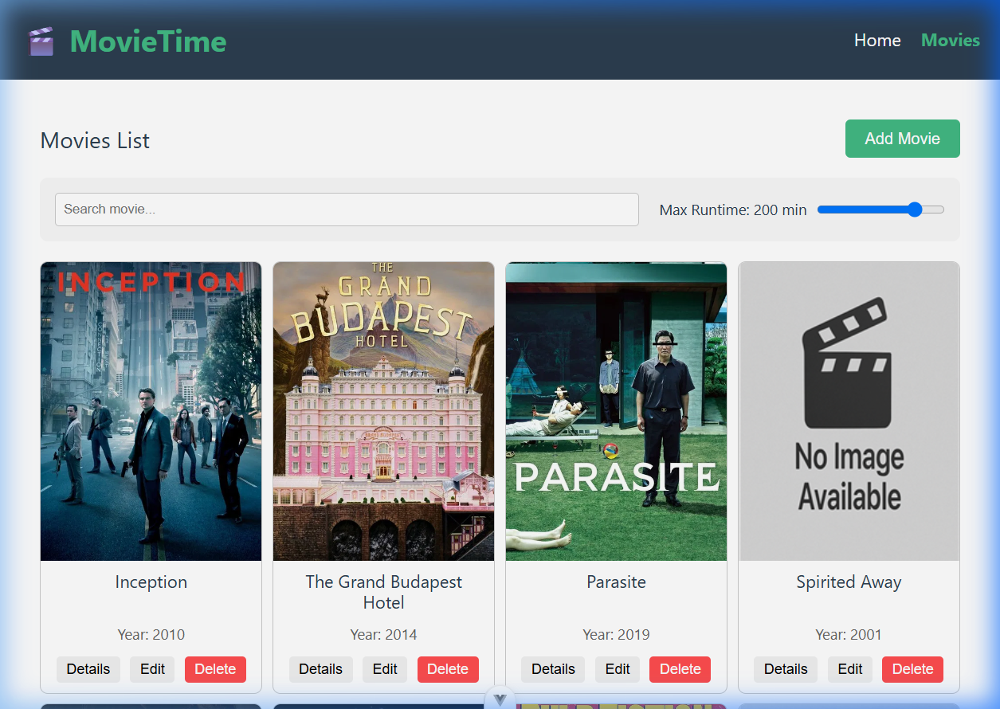
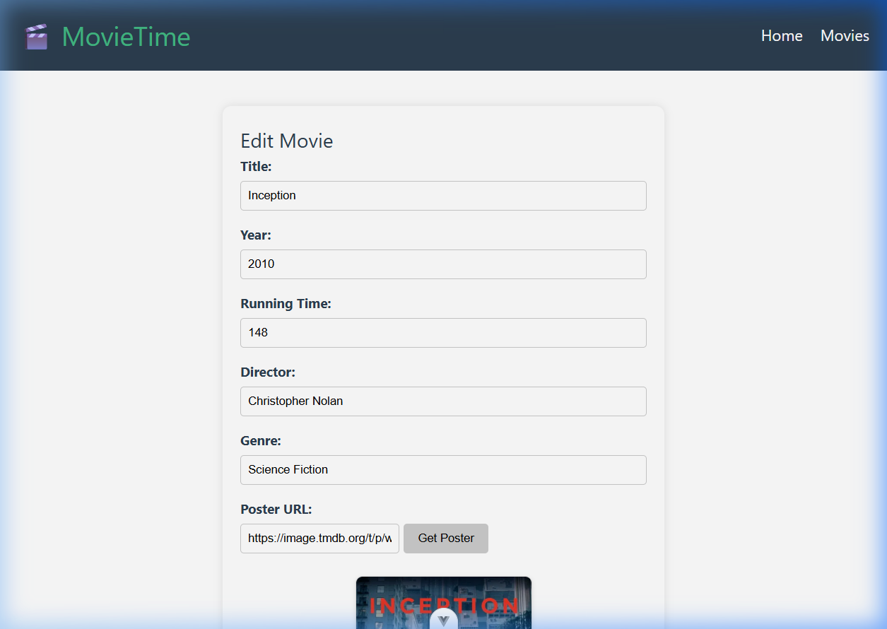

# VueJS Movie Manager

[](https://github.com/aviad-benhamo/github-repository-standard)
[](LICENSE)
[](package.json)
[](package.json)

**Live Demo:** [https://aviad-benhamo.github.io/ca-vue-movie-manager/](https://aviad-benhamo.github.io/ca-vue-movie-manager/)

## Project Status
This repository is an **Experimental / Coding Academy** project designed to practice building frontend CRUD applications using Vue 3 and Vite. It has been aligned with the GitHub Repository Standard (GRS) for proper repository health, structure, and documentation.

## Overview
VueJS Movie Manager is a single-page application (SPA) that lets users manage their movie catalog. Users can view the movie list, filter movies by text and running time, view detailed information, add new movies, edit existing movies, and delete movies. If a movie poster is missing or fails to load, the application dynamically falls back to a locally optimized placeholder image, or automatically attempts to fetch a high-quality poster from the OMDB API when configured.

## Features
- **Movie CRUD**: Full Create, Read, Update, and Delete operations for movies.
- **Dynamic Search & Filtering**: Instant client-side filtering by title/plot text and max running time.
- **OMDB API Integration**: Dynamically fetches official movie posters using the movie title when an OMDB API key is provided.
- **Robust Image Fallback**: Automatically displays an optimized default movie poster placeholder if the poster URL is unavailable or fails to load.
- **Local Storage Persistence**: Saves and loads the movie database to and from the browser's `localStorage` for persistent states across refreshes.
- **Sleek Responsive Styling**: Clean layout utilizing Vanilla CSS with hover scaling effects and cohesive design system elements.

## Screenshots / Demo

[🔗 Explore the Live Demo](https://aviad-benhamo.github.io/ca-vue-movie-manager/)

### Movie Catalog (List View)


### Movie Editor (Edit View)


## Quick Start

### Runtime Prerequisites
- **Node.js**: `^20.19.0` or `>=22.12.0` (as defined in `.nvmrc` and `package.json`).

### Installation
1. Clone the repository:
   ```sh
   git clone https://github.com/aviad-benhamo/ca-vue-movie-manager.git
   cd ca-vue-movie-manager
   ```
2. Install dependencies:
   ```sh
   npm install
   ```

### Running Locally
To launch the Vite development server:
```sh
npm run dev
```
Open [http://localhost:5173/](http://localhost:5173/) in your browser.

## Configuration
The project supports dynamic poster lookups via the OMDB API. 

1. Copy the environment template:
   ```sh
   cp .env.example .env
   ```
2. Open `.env` and set your OMDB API key:
   ```env
   VITE_OMDB_API_KEY=your_api_key_here
   ```
*Note: If no API key is specified, the application warns in the console and gracefully falls back to the default local placeholder.*

## Design Principles
- **Component-Driven Architecture**: Separation of presentation (`MoviePreview`, `MovieFilter`) and layout (`AppHeader`, `AppFooter`).
- **Scoped Styling**: Vanilla CSS is scoped to individual Vue components to prevent stylesheet pollution while maintaining lightweight styling control.
- **Service Isolation**: Movie-specific logic, storage operations, and API integrations are decoupled into a dedicated movie service.

## Project Structure
```
ca-vue-movie-manager/
├── assets/                 # Repository documentation assets
│   └── screenshots/        # App screenshots for the README
├── docs/                   # Additional documentation
│   └── exercise.md         # Exercise instructions and guide
├── public/                 # Static assets served directly
└── src/                    # Source code
    ├── assets/             # Assets bundled by Vite (CSS, images)
    │   ├── images/
    │   │   └── default.png # Compressed placeholder image (<100 KB)
    │   ├── base.css
    │   └── main.css
    ├── cmps/               # Reusable Vue components
    ├── pages/              # Vue page layouts/views
    ├── router/             # Vue Router SPA route definitions
    ├── services/           # Data services (API & storage)
    ├── App.vue             # Root Vue component
    └── main.js             # App entry point
```

## Architecture
- **Framework**: Vue 3 (Composition / Options API).
- **Routing**: Vue Router SPA routing.
- **State & Storage**: Client-side state managed through local component state, persisted locally using custom serialization with the browser's `localStorage` API.
- **External API**: Integration with the OMDB API for poster fetching.

## Development
To prepare the application for production:

### Build production bundle
```sh
npm run build
```
The compiled output is optimized and written to the `dist/` directory.

### Preview production build
```sh
npm run preview
```

## Changelog
For a history of changes and release information, see [CHANGELOG.md](CHANGELOG.md).

## License
Distributed under the MIT License. See [LICENSE](LICENSE) for details.
